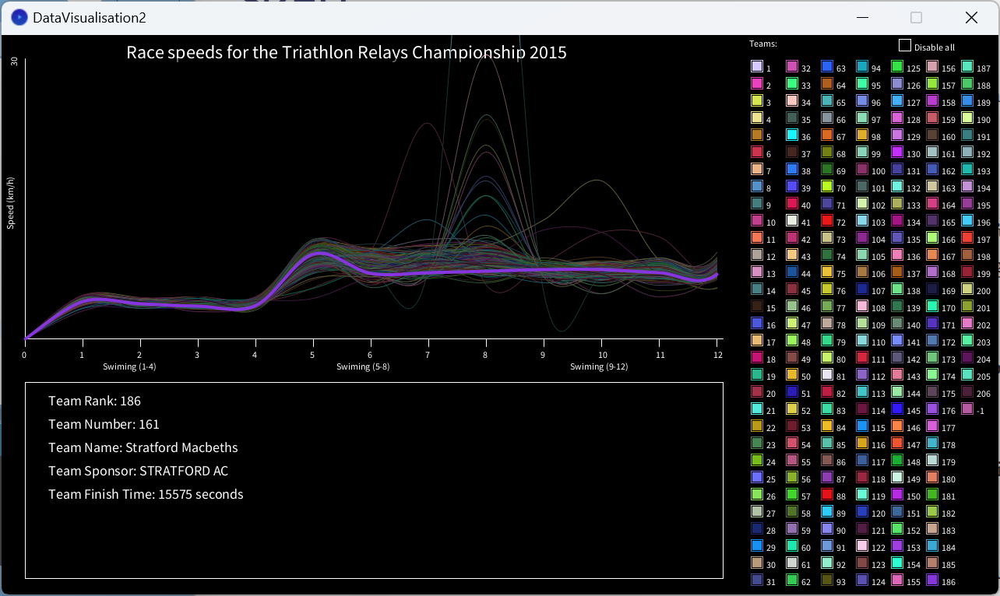

# TriathlonRelayDataVisualisation-

An explorative data visualization project 

Visualisation made for Data Visualisation
University of Twente - EWI - Creative Technology
By Peter Verzijl

#Used
Processing (www.processing.org)
Data from:
Triathlon Relays Champoinship 2013
http://www.resultsbase.net/Results/IndividualResults.aspx?Id=1779

#How to view
Clone the repository or download only the builds folder. The builds folder has the follwing structure:
.\builds\windows\32bit(or 64bit)\DataVisualisation2.exe
Run this executable to view the data visualization.

#Data Visualization
Visualises speed over time for all the 200 relay teams. Times based on samples for each of the 12 checkpoints. 4 swiming, 4 running, 4 cycling.
